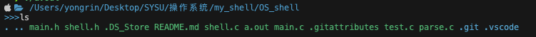

# OS_shell

## 目前进展：
> ls 命令 支持 -l -a 参数
> 
> cd 命令
> 
> cp 命令 支持复制文件夹
> 
> mv 命令 支持移动、重命名文件，文件夹
>
> rm 命令 支持 -r 参数删除文件夹
>
> pwd 命令 
>
> history命令
>
> 输入输出重定向（部分），输出重定向部分已经完成，输入重定向只留接口，没有详细实现
>
> tree 命令 支持 -a 参数
>
> pipe 命令，但是输入的命令顺序有点问题
>
> cat 命令 支持读取文件内容
>
> clear 清屏

## 一些提醒

### How to use
使用命令
```
gcc *.c
```
或者
```
clang *.c
```
将会得到`a.out`文件
运行文件
```
./a.out
```

### 增加一个shell命令的步骤
1. 在`shell.h`中新增一个调用号
```
#define SYS_HISTORY 99
```
但是注意不要与已有的冲突，除此外是可以随便取的
</br>

2. 在`shell.h`中的`sys_table[]`注册函数
```
[SYS_HISTORY] = (syscall_handler_t)syscall_history,
```
左边是刚刚定义的宏，右边是待实现的函数
</br>

3. 在`shell.h`中添加函数声明
```
void syscall_history();
```
</br>

4. 在`shell.h`中的`cmd_list[] `注册命令
```
{
    .name = "history",
    .id = SYS_HISTORY,
},
```
其中name是命令的名字，id是刚刚定义的宏
</br>

5. 前往`shell.c`中实现刚刚注册函数
```
void syscall_history()
{
    FUNCTION_CODE_HERE;
}
```
</br>

6. 如果需要定义一些辅助函数，建议在`shell.h`中的最上方的定义，你应该能够找到在哪。你想在哪定义都是可以的，只不过要确保能够成功编译以及便于维护

</br>

7. 对于一些全局使用的变量，请使用`static`关键字声明，然后在别的文件要使用的话请使用`extern`关键字声明，或者`include`文件，否则会有`duplication`重复定义的错误


### 图标
```
   /Users/yongrin/Desktop/SYSU/操作系统/my_shell/OS_shell
>>>
```


但我只做了苹果的图标，因此理论上只有苹果用户可以看见，Linux用户请前往`main.c`中约15行位置，即`while`循环里第一个`printf`处，将苹果图标进行替换。（实际上可以读取环境信息做到自适应，但是我不想做+__+）
## TODO：
> ps 命令 待整合
> 
> 管道（顺序问题）
>
> 后台运行程序


